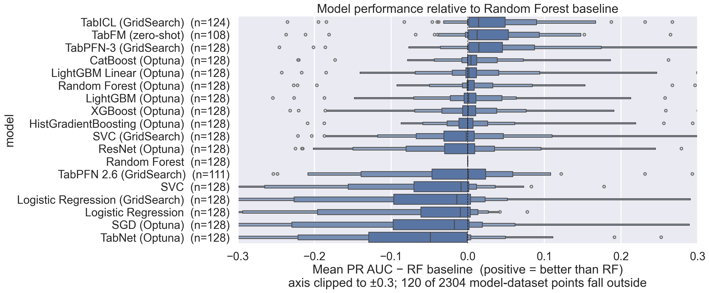
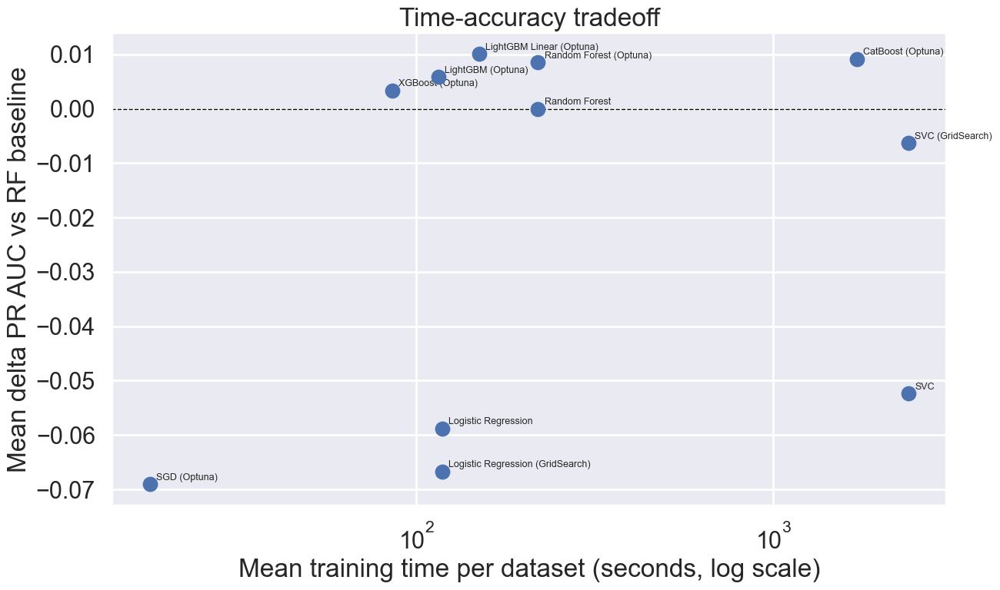
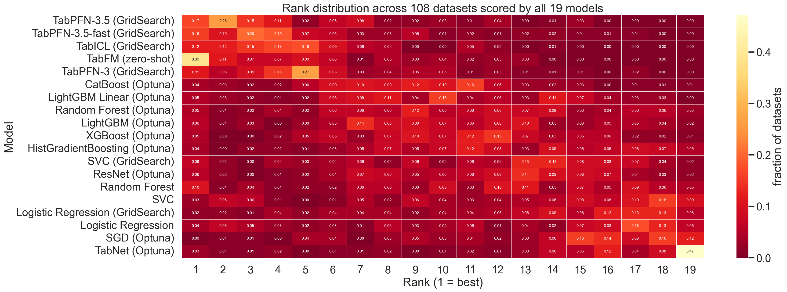

SmallDatasetBenchmarks
======================
Testing machine learning classifiers on small tabular datasets. The original blog post is here: https://www.data-cowboys.com/blog/which-models-are-best-for-small-datasets

## Setup

```bash
uv sync
```

## Experiments

Results are produced in `figures.ipynb` (all models including AutoML) and `figures_no_automl.ipynb` (non-AutoML models only). Each benchmark uses nested cross-validation (4-fold outer × 4-fold inner) with stratified random splits and fixed seeds. The evaluation metric is **PR AUC** (weighted average precision, OvR), which is less sensitive to class imbalance than ROC AUC.

| Script | Description |
|---|---|
| `compare_baseline_models.py` | SVC, Logistic Regression, Random Forest — tuned with `GridSearchCV` |
| `optuna_models.py` | SVC, LogReg (GridSearch); RF, XGBoost, SGD, LightGBM, LightGBM-linear, CatBoost, TabPFN, TabNet, ResNet, FT-Transformer — Optuna TPE, 50 trials per outer fold. FT-Transformer was run on a 67/146 subset only — see [FT_transformer_notes.md](FT_transformer_notes.md) |
| `benchmark_autogluon.py` | AutoGluon with a 1000s wall-clock time budget per fold (`best_quality` preset, 8 CPUs) |
| `benchmark_mljar.py` | MLJAR Supervised with a 1000s wall-clock time budget per fold (`Compete` mode, `n_jobs=8`) |

To reproduce all results sequentially:

```bash
uv run python run_all.py
# AutoGluon must use the venv Python directly (Ray incompatibility with uv run),
# and stdout must be unbuffered to see progress in log files:
PYTHONUNBUFFERED=1 .venv/bin/python -u benchmark_autogluon.py
```

### Categorical features

`compare_baseline_models.py` uses one-hot encoding. `optuna_models.py` handles categories properly:
- **CatBoost** — native `cat_features` support
- **RF, XGBoost, LightGBM** — ordinal encoding via `category_encoders`
- **SVC, LogReg, SGD** — encoding strategy is an Optuna hyperparameter (ordinal, target, James–Stein, m-estimate, CatBoost encoder)

AutoGluon and MLJAR handle categorical features internally.

### Note on FT-Transformer

FT-Transformer was run on 67 of 146 datasets before being stopped. The data is sufficient to conclude that it is **both impractical on CPU and not competitive on accuracy** for this kind of small tabular data: ~150× more compute than tuned gradient boosters for a mean PR-AUC delta of **−0.026** vs. the best GB per dataset. See [FT_transformer_notes.md](FT_transformer_notes.md) for the full breakdown. Excluded from the headline results below.

## Results

### Model performance relative to Random Forest baseline

Mean PR AUC delta across 146 datasets (positive = better than RF).



### Time–accuracy tradeoff

Wall-clock training time per dataset vs mean PR AUC gain over RF.



### Rank distribution across datasets

How often each model achieves each rank (1 = best on a given dataset).



## Observations

- Non-linear models outperform linear ones even on datasets with fewer than 100 samples.
- Optuna-tuned XGBoost and CatBoost are the strongest individual models, competitive with AutoML frameworks.
- AutoGluon and MLJAR show higher median PR AUC, but require a substantial wall-clock budget (1000s/fold used here).
- Proper categorical feature handling gives a meaningful boost on datasets with string features (~30% of the benchmark).
- LightGBM with linear trees (`linear_tree=True`) is a useful addition to the Optuna model set.
- Among neural baselines, **TabPFN** is the only one consistently competitive with tuned GBs on completable datasets; TabNet, ResNet and FT-Transformer do not match GB accuracy on average and cost 1–2 orders of magnitude more compute. See [TabPFN_notes.md](TabPFN_notes.md) and [FT_transformer_notes.md](FT_transformer_notes.md).

### Note on AutoGluon operational complexity

Running AutoGluon reliably in a long CPU benchmark required several non-obvious workarounds — worth noting as a practical consideration when choosing an AutoML framework:

- **`dynamic_stacking=False` is required.** With the default `best_quality` preset, AutoGluon's stacking phase can consume more time during initialization than the `time_limit` budget allows, causing an `AssertionError` before any model is trained.
- **Neural network models (`NeuralNetFastAI`, `NeuralNetTorch`) must be excluded on CPU.** These models do not reliably respect `time_limit` on CPU hardware, causing the process to hang indefinitely — sometimes for 10+ hours — without producing any output or checkpoint updates. Add `excluded_model_types=["NeuralNetFastAI", "NeuralNetTorch"]` to `.fit()`.
- **Stdout must be unbuffered.** When running as a background process redirected to a log file, Python's default buffering suppresses all `print()` output, making it impossible to monitor progress. Launch with `python -u` or `PYTHONUNBUFFERED=1`.
- **Ray subprocess lifecycle.** AutoGluon spawns Ray worker processes that outlive crashes. After a hang or kill, Ray child processes must be cleaned up manually before restarting.

The upshot: AutoGluon is powerful but has meaningful operational overhead on CPU-only machines. For automated or unattended runs, MLJAR is significantly more robust out of the box.

## Data

A subset of UCI++: "a huge collection of preprocessed datasets for supervised classification problems in ARFF format"
[](http://dx.doi.org/10.5281/zenodo.13748)

146 datasets, up to 10 000 rows each (larger datasets are subsampled). Note that UCI++ reuses the same datasets in different configurations and some categorical features are not clearly labeled.
