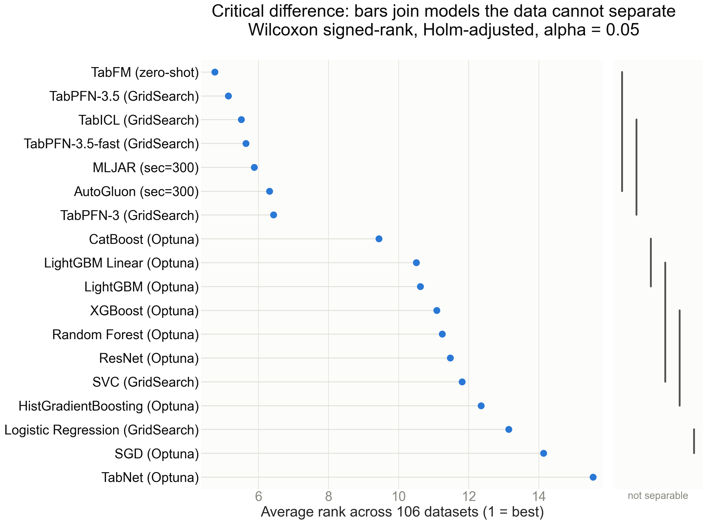
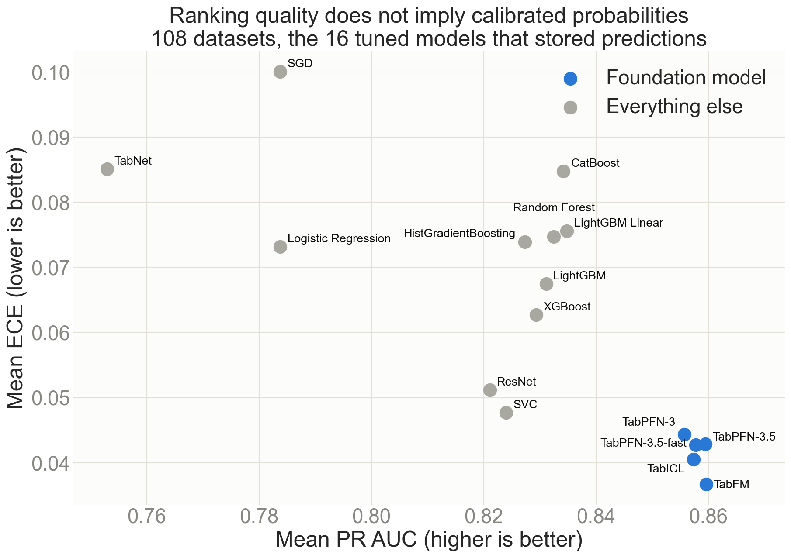

SmallDatasetBenchmarks
======================
Testing machine learning classifiers on small tabular datasets. The original blog post is here: https://www.data-cowboys.com/blog/which-models-are-best-for-small-datasets

## Setup

```bash
uv sync
```

## Experiments

Results are produced in `figures.ipynb` (all models including AutoML) and `figures_no_automl.ipynb` (non-AutoML models only). Each benchmark uses nested cross-validation (4-fold outer × 4-fold inner) with stratified random splits and fixed seeds. The evaluation metric is **PR AUC** (weighted average precision, OvR), which is less sensitive to class imbalance than ROC AUC. Differences between models are tested with Friedman followed by pairwise Wilcoxon signed-rank with Holm correction, one dataset per observation. Calibration is reported separately as Brier score and top-label ECE, since PR AUC scores ranking only.

| Script | Description |
|---|---|
| `compare_baseline_models.py` | SVC, Logistic Regression, Random Forest — tuned with `GridSearchCV` |
| `optuna_models.py` | SVC, LogReg, TabPFN-3, TabPFN-3.5, TabPFN-3.5-fast, TabICL (GridSearch); TabFM (zero-shot); RF, XGBoost, SGD, LightGBM, LightGBM-linear, CatBoost, HistGradientBoosting, ResNet, TabNet (Optuna TPE, 50 trials per outer fold) |
| `benchmark_autogluon.py` | AutoGluon with a 300s wall-clock budget per fold (`best_quality` preset, 8 CPUs) |
| `benchmark_mljar.py` | MLJAR Supervised with a 300s wall-clock budget per fold (`Compete` mode, `n_jobs=8`) |

The AutoML figures come from the **300s-per-fold** runs (`results/*_sec_300.joblib`, ~20 min per dataset), the budget both frameworks share. A 1000s MLJAR run also exists but the matching AutoGluon run was abandoned after 11 datasets, so plotting it would compare the two at different budgets.

FT-Transformer is **not in this iteration**. It and TabNet were previously reported on numbers produced by runs in which they were largely failing to train; TabNet is now measured properly. See [Findings_notes.md](Findings_notes.md#the-bug-that-produced-two-published-results) and [FT_transformer_notes.md](FT_transformer_notes.md).

To reproduce all results sequentially:

```bash
uv run python run_all.py
# AutoGluon must use the venv Python directly (Ray incompatibility with uv run),
# and stdout must be unbuffered to see progress in log files:
PYTHONUNBUFFERED=1 .venv/bin/python -u benchmark_autogluon.py
```

Runs skip the 15 UCI++ duplicates listed in `config.DUPLICATE_DATASETS`, which every
figure drops anyway. After a run, `uv run python -m scripts.check_prevalence_baseline`
lists any (model, dataset) pair scoring no better than predicting the class prior —
the failure that once produced two published results.

### Categorical features

`compare_baseline_models.py` uses one-hot encoding. `optuna_models.py` handles categories properly:
- **CatBoost** — native `cat_features` support
- **TabPFN, TabFM** — native categorical indices
- **TabICL** — auto-detects categorical columns from pandas dtype
- **RF, XGBoost, LightGBM, HistGradientBoosting** — ordinal encoding via `category_encoders` (NaN handled natively)
- **ResNet, TabNet** — ordinal-encode + impute inside the wrapper (ResNet also standardises)
- **SVC, LogReg, SGD** — encoding strategy is a search hyperparameter (ordinal, target, James–Stein, m-estimate, CatBoost encoder)

AutoGluon and MLJAR handle categorical features internally.

## Headline

There are three tiers, and they are separated by cost far more than by performance.

**AutoML and the current foundation models are one tier.** On the 106 datasets the figures use, MLJAR leads TabFM by 0.0295 mean PR AUC but wins only 61 of them. That lead is nominally significant (Wilcoxon signed-rank, p = 0.015) and does not survive correction for the 153 pairwise comparisons in the family (Holm p = 0.36) — the honest reading is that this benchmark does not separate them. The critical-difference diagram puts six models in that tier with no bar able to split them. All of them separate cleanly from the best classical model: MLJAR over CatBoost p = 0.001, TabFM over CatBoost p = 4e-10 on 89 of 106 datasets. What sets AutoML apart here is the budget it is handed — twenty minutes a dataset — not a different class of result.

**A new generation of foundation model arrived mid-benchmark and it is both better and cheaper.** Over the same 131 datasets, TabPFN-3.5 scores 0.8627 against TabPFN-3's 0.8571 in **17.8 hours against 63.6** — a 3.6x cost cut that the test confirms as a real gain (p = 0.005, 71 wins of 106). The `v3.5-fast` variant halves the cost again to 9.3 hours for 0.8608, and the test cannot separate it from full 3.5 (p = 0.06). Within one model family the price moved by a factor of nearly seven while performance moved in the third decimal. See [FoundationModels_notes.md](FoundationModels_notes.md).

**Foundation models are the cheapest way into that tier, on the right hardware.** TabFM reaches 0.8653 over its 126 datasets in 4.3 hours, but it ran on MPS while everything else here ran on CPU. At the 17-36x CPU/MPS ratio measured on this machine that is 73-155 CPU-hours against XGBoost's 7.4, so its time column is not comparable to the rest of the table. On CPU the answer is now TabPFN-3.5-fast at 9.3 hours, ahead of TabICL's 29.8 over the same 131 datasets. The four current-generation models span 0.0079, and the test still separates TabFM from TabPFN-3 (p = 0.004, 73 wins of 106) — the gaps are small, not absent.

**The classical models are nearly interchangeable, with one real ordering inside.** CatBoost 0.8386, LightGBM-linear 0.8374, Random Forest 0.8359, LightGBM 0.8345, XGBoost 0.8328, HistGradientBoosting 0.8303 — the whole block spans 0.009, which is less than the run-to-run seed variance measured on a single neural model. The test still puts CatBoost above HistGradientBoosting (p = 0.0003) and above Random Forest (p = 0.04, a 0.0021 gap won on 70 of 106 datasets), while leaving it tied with LightGBM-linear. Random Forest gets 0.8359 for 7.6 hours; CatBoost gets +0.003 more for 75.7.

Coverage differs by model, and the means and hours above are each over a model's own datasets — 146 for the models that predate the duplicate skip, 131 for the two TabPFN-3.5 variants, fewer where a foundation model refuses a dataset. Where two models are compared on cost, both numbers are over the same 131. Of the 131 datasets a run now covers, 109 are scored by every model; the rest are refused by one foundation model or another on feature or class limits. Every figure below uses complete cases only and states its own `n`, which differs because the populations differ: the rank distribution is drawn without the two AutoML models and with both the tuned and the untuned entries of SVC, LogReg and Random Forest, while the critical-difference diagram includes AutoML and drops the untuned duplicates (106 datasets, 18 entries). Reconciling the two is [open work](#known-gaps).

## Results

### Model performance relative to Random Forest baseline


### Time vs performance

Wall-clock training time per dataset vs mean PR AUC gain over RF.


### Rank distribution across datasets

How often each model achieves each rank (1 = best on a given dataset).


### Which differences the data supports

Average rank over the datasets every model scores, with a bar over each group the
paired test cannot separate. The top bar spans six models — TabFM, TabPFN-3.5,
TabICL, TabPFN-3.5-fast and both AutoML frameworks — and nothing in this benchmark
splits them. A bar requires every pair inside it to be inseparable, so TabPFN-3
falls outside that bar while sharing the second one: it separates from TabFM.



### Calibration

PR AUC scores ranking only, so a model can order every case correctly and still be
systematically overconfident. Brier and ECE come from the same stored out-of-fold
predictions; AutoGluon and MLJAR keep none and are absent here.



## Observations

- **Cost does not track performance.** The two most expensive models — TabNet (485.3 h) and ResNet (207.7 h) — finish last and fourth from last, both below Random Forest at 7.6 h. CatBoost spends 75.7 h to beat Random Forest by 0.003. Full ladder in [Findings_notes.md](Findings_notes.md#cost-does-not-track-performance).
- **Foundation models have no shared blind spot.** They match or beat the best of eleven classical models on 109 of 131 datasets (83.2%), and only 3 datasets have any classical model ahead by more than 0.02. An earlier version of this README claimed a blind spot on small imbalanced medical data; that was a scoring bug, described in [Findings_notes.md](Findings_notes.md#label-ordering-silently-changed-the-metric).
- **Ensembling never helped.** Averaging stored predictions — probability, logit and rank — across every combination tried failed to beat the best single model. The strongest, a logit average of the three foundation models available at the time, ties it to within 0.0001 and wins on 39% of datasets. Adding CatBoost to that trio makes it worse. The two TabPFN-3.5 variants arrived later and have not been put through that analysis.
- **Where foundation models win big is synthetic structured noise**, not small data generally: on `hill-valley-with-noise` CatBoost scores 0.5560 against TabICL's 0.9967.
- **The TabPFN line is the coverage answer.** All three of its versions score every dataset they are given — 131 of 131 — while TabICL refuses 4 and TabFM 20 on feature or class limits. On the 20 datasets TabICL or TabFM refuses, TabPFN beats the best of eleven classical models on 18.
- **The best-ranking model is not the best-calibrated one.** The five foundation models take the five lowest ECE values (0.0367-0.0443); CatBoost, the strongest classical model on PR AUC, is fourteenth of sixteen at 0.0848. Anything that consumes the probability rather than the ordering — a threshold, a cost model, a downstream expected value — gets a different answer from these two rankings.
- **Trained-from-scratch neural networks lose.** ResNet spends 207.7 h to land below Random Forest, and TabNet 485.3 h to finish last. The line is not "neural loses" — TabICL is a neural model and is both cheap and strong — but between *trained from scratch on your 1500 rows* and *pretrained, used in context*.
- Non-linear models outperform linear ones even on datasets with fewer than 100 samples.
- Proper categorical feature handling gives a meaningful boost on datasets with string features (~30% of the benchmark).

Method defects found and fixed during this iteration, including two that had produced published numbers, are written up in [Findings_notes.md](Findings_notes.md).

### Known gaps

- The figures are rendered by two notebooks over different model sets, so `rank_distribution.png` (108 datasets, no AutoML, 19 entries) and `critical_difference.png` (106 datasets, AutoML, 18 entries) disagree about the denominator of a rank. The dataset filters, the threshold and the model labels are now shared constants, but the load-and-reshape block is still copied; one loader owning it would remove the mismatch.
- The ~10 % of compute already spent on the duplicate datasets is spent. The runners skip them now, which only helps a future run.
- AutoGluon and MLJAR store no predictions, so they are absent from the calibration figure and cannot be ensembled or re-scored without a re-run.

### Note on AutoGluon operational complexity

Running AutoGluon reliably in a long CPU benchmark required several non-obvious workarounds:

- **`dynamic_stacking=False` is required.** With the default `best_quality` preset, AutoGluon's stacking phase can consume more time during initialization than the `time_limit` budget allows, causing an `AssertionError` before any model is trained.
- **Neural network models (`NeuralNetFastAI`, `NeuralNetTorch`) must be excluded on CPU.** These do not reliably respect `time_limit` on CPU hardware and hang indefinitely — sometimes 10+ hours — without output or checkpoint updates.
- **Stdout must be unbuffered.** Launch with `python -u` or `PYTHONUNBUFFERED=1`, or background-process output is suppressed entirely.
- **Ray subprocess lifecycle.** AutoGluon spawns Ray workers that outlive crashes and must be cleaned up manually before restarting.

MLJAR is significantly more robust out of the box, and scores marginally higher here.

## Data

A subset of UCI++: "a huge collection of preprocessed datasets for supervised classification problems in ARFF format"
[](http://dx.doi.org/10.5281/zenodo.13748)

146 datasets, up to 10 000 rows each (larger datasets are subsampled). UCI++ reuses the same data in different configurations; 15 such duplicates are excluded from the figures, and runs now skip them, so a fresh run covers 131 — see [Findings_notes.md](Findings_notes.md#fifteen-datasets-are-duplicates).
