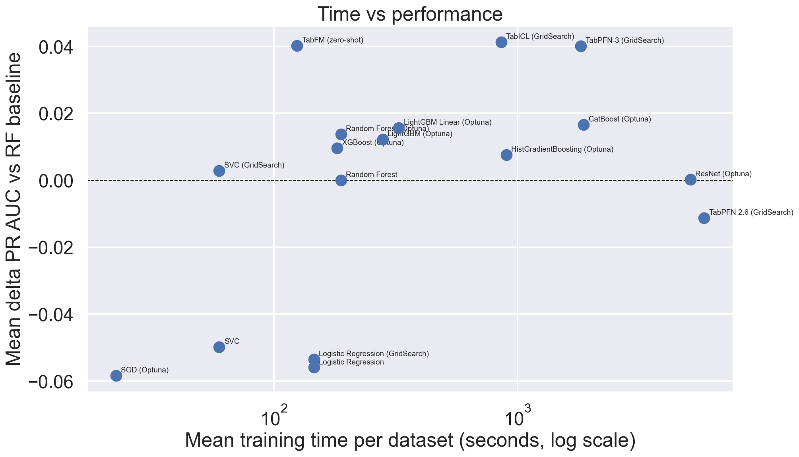

SmallDatasetBenchmarks
======================
Testing machine learning classifiers on small tabular datasets. The original blog post is here: https://www.data-cowboys.com/blog/which-models-are-best-for-small-datasets

## Setup

```bash
uv sync
```

## Experiments

Results are produced in `figures.ipynb` (all models including AutoML) and `figures_no_automl.ipynb` (non-AutoML models only). Each benchmark uses nested cross-validation (4-fold outer × 4-fold inner) with stratified random splits and fixed seeds. The evaluation metric is **PR AUC** (weighted average precision, OvR), which is less sensitive to class imbalance than ROC AUC.

| Script | Description |
|---|---|
| `compare_baseline_models.py` | SVC, Logistic Regression, Random Forest — tuned with `GridSearchCV` |
| `optuna_models.py` | SVC, LogReg, TabPFN 2.6, TabPFN-3, TabICL (GridSearch); TabFM (zero-shot); RF, XGBoost, SGD, LightGBM, LightGBM-linear, CatBoost, HistGradientBoosting, ResNet (Optuna TPE, 50 trials per outer fold) |
| `benchmark_autogluon.py` | AutoGluon with a 300s wall-clock budget per fold (`best_quality` preset, 8 CPUs) |
| `benchmark_mljar.py` | MLJAR Supervised with a 300s wall-clock budget per fold (`Compete` mode, `n_jobs=8`) |

The AutoML figures come from the **300s-per-fold** runs (`results/*_sec_300.joblib`, ~20 min per dataset), the budget both frameworks share. A 1000s MLJAR run also exists but the matching AutoGluon run was abandoned after 11 datasets, so plotting it would compare the two at different budgets.

TabNet and FT-Transformer are **not in this iteration**. Both were previously reported on numbers produced by a run in which they were largely failing to train; see [Findings_notes.md](Findings_notes.md#the-bug-that-produced-two-published-results) and [FT_transformer_notes.md](FT_transformer_notes.md).

To reproduce all results sequentially:

```bash
uv run python run_all.py
# AutoGluon must use the venv Python directly (Ray incompatibility with uv run),
# and stdout must be unbuffered to see progress in log files:
PYTHONUNBUFFERED=1 .venv/bin/python -u benchmark_autogluon.py
```

### Categorical features

`compare_baseline_models.py` uses one-hot encoding. `optuna_models.py` handles categories properly:
- **CatBoost** — native `cat_features` support
- **TabPFN, TabFM** — native categorical indices
- **TabICL** — auto-detects categorical columns from pandas dtype
- **RF, XGBoost, LightGBM, HistGradientBoosting** — ordinal encoding via `category_encoders` (NaN handled natively)
- **ResNet** — ordinal-encode + impute + StandardScaler inside the wrapper
- **SVC, LogReg, SGD** — encoding strategy is a search hyperparameter (ordinal, target, James–Stein, m-estimate, CatBoost encoder)

AutoGluon and MLJAR handle categorical features internally.

## Headline

There are three tiers, and they are separated by cost as much as by performance.

**AutoML wins, given twenty minutes a dataset.** On the 124 datasets every model covers, MLJAR reaches 0.8965 mean PR AUC and AutoGluon 0.8944, against 0.8721 for the best foundation model. MLJAR beats TabICL on 61% of those datasets and TabFM on 56%.

**Foundation models are the best value.** TabFM reaches 0.8653 over its 126 datasets in **4.3 hours total** — the highest mean of any single model in the benchmark, for less compute than XGBoost. TabICL is the CPU choice at 0.8574 over 142 datasets in 34.7 hours. The three current-generation models (TabFM, TabICL, TabPFN-3) are practically equivalent on performance, spanning 0.0043; what separates them is cost and coverage. See [FoundationModels_notes.md](FoundationModels_notes.md).

**The classical models are nearly interchangeable.** CatBoost 0.8386, LightGBM-linear 0.8374, Random Forest 0.8359, LightGBM 0.8345, XGBoost 0.8328, HistGradientBoosting 0.8303 — the whole block spans 0.009, which is less than the run-to-run seed variance measured on a single neural model. Random Forest gets 0.8359 for 7.6 hours; CatBoost gets +0.003 more for 75.7.

Coverage differs by model and the means above are each over a model's own datasets. Only 126 of 146 datasets are scored by every model; the figures below state `n` on every row and the rank heatmap uses complete cases only.

## Results

### Model performance relative to Random Forest baseline


### Time vs performance

Wall-clock training time per dataset vs mean PR AUC gain over RF.



### Rank distribution across datasets

How often each model achieves each rank (1 = best on a given dataset).


## Observations

- **Cost does not track performance.** The two most expensive models, TabPFN 2.6 (236.3 h) and ResNet (207.7 h), rank eleventh and twelfth of fourteen. Together they cost more than every other model combined and both land below Random Forest at 7.6 h. Full ladder in [Findings_notes.md](Findings_notes.md#cost-does-not-track-performance).
- **Foundation models have no shared blind spot.** They match or beat the best of ten classical models on 116 of 146 datasets (79.5%), and only 2 datasets have any classical model ahead by more than 0.02. An earlier version of this README claimed a blind spot on small imbalanced medical data; that was a scoring bug, described in [Findings_notes.md](Findings_notes.md#label-ordering-silently-changed-the-metric).
- **Ensembling never helped.** Averaging stored predictions — probability, logit and rank — across every combination tried failed to beat the best single model. The strongest, a logit average of the three foundation models, ties it to within 0.0001 and wins on 39% of datasets. Adding CatBoost to that trio makes it worse.
- **Where foundation models win big is synthetic structured noise**, not small data generally: on `hill-valley-with-noise` CatBoost scores 0.5560 against TabICL's 0.9967.
- **TabPFN-3 is the coverage answer.** It is the only model that scores all 146 datasets, and on the 20 that at least one other foundation model refuses it beats the best classical model on 16.
- **Trained-from-scratch neural networks lose.** ResNet spends 207.7 h to land below Random Forest. The line is not "neural loses" — TabICL is a neural model and is both cheap and strong — but between *trained from scratch on your 1500 rows* and *pretrained, used in context*.
- Non-linear models outperform linear ones even on datasets with fewer than 100 samples.
- Proper categorical feature handling gives a meaningful boost on datasets with string features (~30% of the benchmark).

Method defects found and fixed during this iteration, including two that had produced published numbers, are written up in [Findings_notes.md](Findings_notes.md).

### Note on AutoGluon operational complexity

Running AutoGluon reliably in a long CPU benchmark required several non-obvious workarounds:

- **`dynamic_stacking=False` is required.** With the default `best_quality` preset, AutoGluon's stacking phase can consume more time during initialization than the `time_limit` budget allows, causing an `AssertionError` before any model is trained.
- **Neural network models (`NeuralNetFastAI`, `NeuralNetTorch`) must be excluded on CPU.** These do not reliably respect `time_limit` on CPU hardware and hang indefinitely — sometimes 10+ hours — without output or checkpoint updates.
- **Stdout must be unbuffered.** Launch with `python -u` or `PYTHONUNBUFFERED=1`, or background-process output is suppressed entirely.
- **Ray subprocess lifecycle.** AutoGluon spawns Ray workers that outlive crashes and must be cleaned up manually before restarting.

MLJAR is significantly more robust out of the box, and scores marginally higher here.

## Data

A subset of UCI++: "a huge collection of preprocessed datasets for supervised classification problems in ARFF format"
[](http://dx.doi.org/10.5281/zenodo.13748)

146 datasets, up to 10 000 rows each (larger datasets are subsampled). UCI++ reuses the same data in different configurations; 15 such duplicates are excluded from the figures but still computed — see [Findings_notes.md](Findings_notes.md#fifteen-datasets-are-duplicates).
